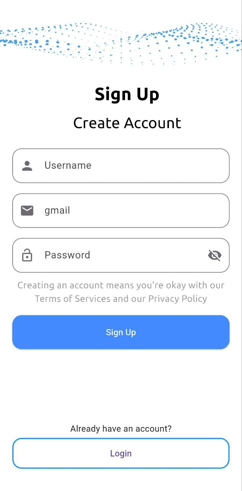
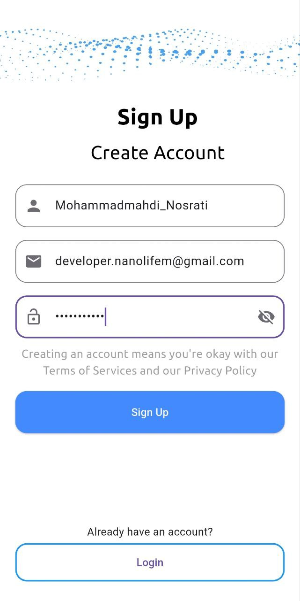
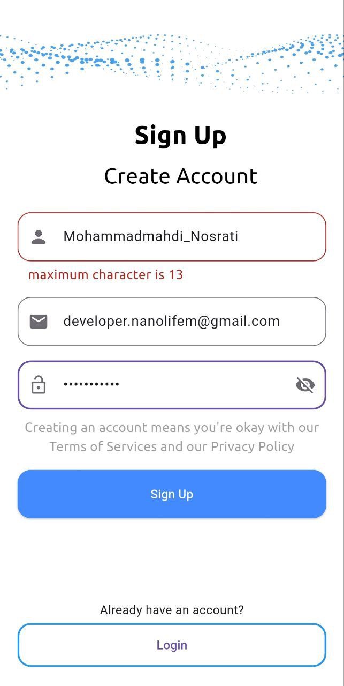
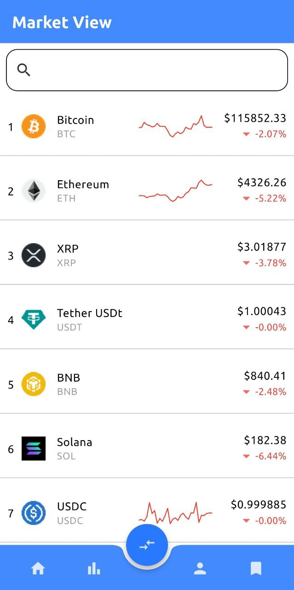
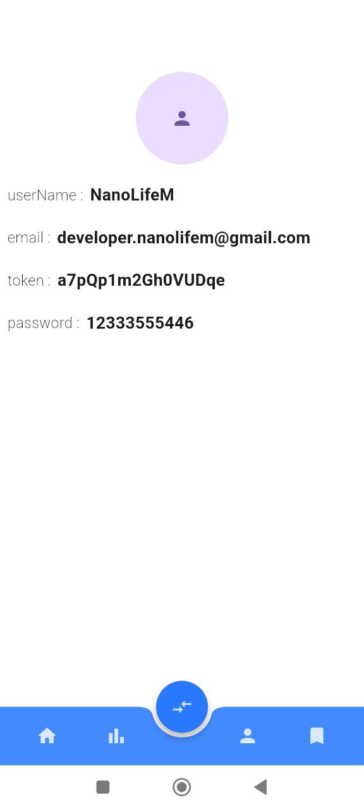

# Exchange\_Bs

A cross-platform Flutter starter app for an exchange-style UI. This repository contains a minimal Flutter project skeleton that targets mobile, web, and desktop platforms and includes a demo **fake login screen** for UI testing and presentation.

> ⚠️ **Important:** This project is provided as a demo / prototype. The included login screen is a *fake/demo* login and there is no production-ready authentication or secure API integration in this repository. Do **not** use this code as-is for handling real user credentials or production funds.

---

## Features

* Flutter multi-platform scaffold (Android, iOS, Web, Linux, macOS, Windows).
* Demo **fake login** screen for UI/UX testing.
* Clear project separation for data, logic, and presentation layers.
* Placeholder assets and sample screens.

---

## Screenshots

Below are example screenshots. Images are scaled for preview (no file paths are shown in the prose).

<div align="center">


<br/>


<br/>


</div>

*Note:* Images must be committed to the repository for them to render on GitHub.

---

## Assets

The repository includes the following image files (used above as screenshots):

* `image1.jpg`
* `image2.jpg`
* `image3.jpg`
* `image4.jpg`
* `image5.jpg`
* `image6.jpg`

(Place these files under your `assets` folder and list the assets in `pubspec.yaml`.)

---

## Project Structure (high level)

```
Exchange_Bs/
├─ android/
├─ ios/
├─ web/
├─ linux/
├─ macos/
├─ windows/
├─ lib/
│  ├─ data/
│  │  ├─ data_source/     # Data sources (API clients, local DB adapters)
│  │  ├─ models/          # Data models / entities
│  │  └─ repository/      # Repository layer (interfaces & implementations)
│  │
│  ├─ logic/
│  │  └─ provider/        # State management (Provider classes)
│  │
│  ├─ presentation/
│  │  ├─ helper/          # UI helper utilities
│  │  └─ ui/
│  │     └─ ui_helper/    # Reusable UI components and widgets
│  │
│  └─ main.dart           # Application entry point
│
├─ assets/
│  └─ readme_files/       # Screenshots and other bundled images
├─ test/
├─ pubspec.yaml
└─ README.md
```

### Notes about `lib/`

* `lib/data/data_source/` — place API client code, HTTP adapters, local storage adapters, and any raw data fetching logic here.
* `lib/data/models/` — data classes and JSON (de)serialization code (e.g., `fromJson` / `toJson`).
* `lib/data/repository/` — repository interfaces and concrete implementations that the app uses to fetch and persist data.
* `lib/logic/provider/` — Provider-based state management classes (ChangeNotifiers, Providers, or Riverpod wrappers if used).
* `lib/presentation/helper/` and `lib/presentation/ui/ui_helper/` — UI helpers, common widgets, theme setup, and small utilities used by screens.

This separation helps keep the codebase maintainable and makes it easier to replace implementations (for example, swap a fake repository with a real API-backed one).

---

## Getting Started

### Prerequisites

* [Flutter SDK](https://flutter.dev) (recommended stable channel)
* An IDE such as Android Studio, VS Code, or IntelliJ with Flutter plugins
* Platform toolchains for the targets you want (Android SDK, Xcode for macOS/iOS, etc.)

### Clone and run

```bash
# clone the repo
git clone https://github.com/NanoLifeM/Exchange_Bs.git
cd Exchange_Bs

# get dependencies
flutter pub get

# run on the default connected device or emulator
flutter run
```

To run on a specific platform, include the `-d` flag with a device id or use `flutter run -d chrome` for web.

### Make sure assets are declared in `pubspec.yaml`

Under `flutter:` add the assets folder, for example:

```yaml
flutter:
  assets:
    - assets/readme_files/
```

---

## Usage

* This repository is intended as a UI prototype and starting point.
* The fake login is suitable for showcasing navigation, flows, and UI only.
* Replace the fake login and mock data with real authentication and secure API calls before using in production.

---

## Contributing

Contributions are welcome. If you plan to add features or fix bugs:

1. Create an issue to discuss bigger changes.
2. Make a feature branch from `main`.
3. Open a pull request when your changes are ready.

Please keep commits focused and provide clear PR descriptions.

---

## Roadmap / Ideas

* Add real exchange API integration (with secure key management).
* Implement proper authentication and token handling.
* Add automated tests and CI for multiple platforms.
* Improve UI polish and accessibility.

---

## License

This repository does not include a license file by default. If you want a permissive license, consider adding an `MIT` license or another license of your choice. (If you want, I can generate a LICENSE file for you.)

---

## Contact

If you have questions or want to collaborate, contact the project owner on Telegram:

**@NanoLifeM**

(Please respect privacy and only send messages relevant to the project.)

---

*Generated README — tell me if you want a Persian translation, smaller images, different gallery layout, or specific alt text for each image.*
